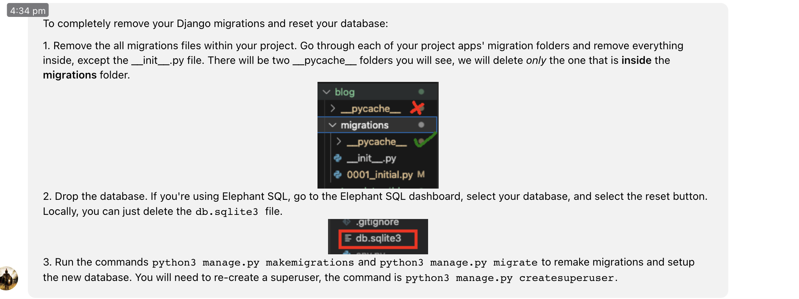

# Gold Scroll 

# * Disclaimer: 
###  Unfortunately this project has led to undesired result than anticipated,
###  Due to lots of personal stress, recent sickness in flu and long days at work + scarce assistance from TUT support by all 90 minutes per week came to an end before submission did led to the work on this project hasn't reach its objective.
### I am well aware that this will led to absolute failure to its grading, yet I am coming with my frank words in beginning in this readme.md file so the exception isn't as high to start with to whom whoever is reading this message or scan the project itself for its features & orientation.

### Gold Scroll is based upon Boutique Ado - a walkthrough project that demonstrates its value to create an e-commerce site and lots of its foundation is built upon to this one -> Gold Scroll.

## Reasons to this failure:

### Obsolete learning content from Code Institute 
- e.g. Allauth recent setup looks very differently compared to Boutique Ado, thus a confusing element. (After grading this will be deleted and another login or sign up pages will be created independently )
- Stripe has changed a lot since the video from Code Institute uploaded its learning video, yet,
     - Stripe is installed on the website it's shows that "payments" has been made yet:
        - I need to go to stripe dashboard create webhook with urls of your gitpod project (first setting up local webhook) and copy webhook secret key in the : STRIPE_WH_SECRET variable (but its all in detail explained in the walkthrough videos under stripe section)

- Due to some issues regarding the migrations I was forced to to delete the previous files on all the apps, guided by "Roman" on TuT support on Code Institute.

    - Thus the credit cart function is gone and it was seen before on the checkout page
    - It's an "arrow" that you use on the Merchandise list to direct you back on the top of the page, it's now gone since this technological failure occurred. 
   

# FEATURES:
- Lots of the features in this project is quite similar to Boutique Ado & thus another reason to this projects failure. 

#### This is how it looks like for now and changes will be adjusted:

#### The features that I had to time to implement: 

## Opening Page:

### Click on the "Buy Now" Button:

###  or click "All Gold Merchandise" button in the navbar

### You come to the Merchandise/Product list:

## Left to implement:

- [ ]       add product
- [ ] 		update product 
- [ ] 		delete product 
- [ ]       payment into the app (using stripe) (Need to: go stripe dashboard create webhook with urls of your gitpod project (first setting up local webhook) and copy webhook secret key in the:           
            STRIPE_WH_SECRET variable (but its all in detail explained in the walkthrough videos under stripe section))
		
- [ ] 		Make sure the form to add product is validated (be specific about what the users are sending through the form)
		
- [ ] 		Create a newsletter functionality
		
- [ ] 		A facebook page
		
- [ ] 		User profile feature
		
- [ ] 		Login/register
		
- [ ] 		Restrict non logged in users from accessing some pages and some functionalities like adding products, deleting and updating
		
- [ ] 		Include a sitemap on your application to allow search engine bot crawling - Meta up in the page. 
		
- [ ] 		Include a robots.txt file to control search engine bot crawling - Marketing elements 
		
- [ ] 		Use an Agile tool to manage the planning and implementation of all primary functionality

# Another missing element that hasn't unfortunately been added into the project:

- Upload to Heroku
- Add the project's Data Base to Elephant SQL 

# Media
 - [Pexels](https://www.pexels.com/)
 - [Merchandise images where taken from Amazon](https://www.amazon.se/-/en/)

# Credits

### These sources will be continued to be used after the grading and feedback on this project. 

- [Boutique Ado](https://github.com/Code-Institute-Solutions/Django3blog/tree/master/12_final_deployment) - [Website: ](https://learn.codeinstitute.net/courses/course-v1:CodeInstitute+EA101+2021_T1/courseware/eb05f06e62c64ac89823cc956fcd8191/3adff2bf4a78469db72c5330b1afa836/?child=last) & [Full-Template: ](https://github.com/Code-Institute-Org/ci-full-template)

- [Learn Django by Building an Online Marketplace – Python Tutorial for Beginners](https://www.youtube.com/watch?v=ZxMB6Njs3ck)
- [Django For Everybody - Full Python University Course](https://www.youtube.com/watch?v=o0XbHvKxw7Y)
- [Python Django Web Framework - Full Course for Beginners](https://www.youtube.com/watch?v=F5mRW0jo-U4&t=1795s)
### Found these this stripe sources late and will be implemented after feedback:
- [How to use Stripe for payment in Django](https://www.youtube.com/watch?v=hZYWtK2k1P8)
- [Django and Stripe Payments Tutorial](https://www.youtube.com/watch?v=722A27IoQnk)
- 
- 
